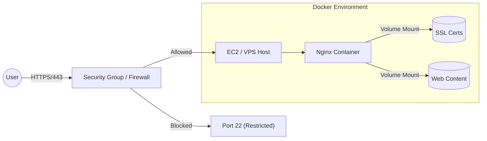
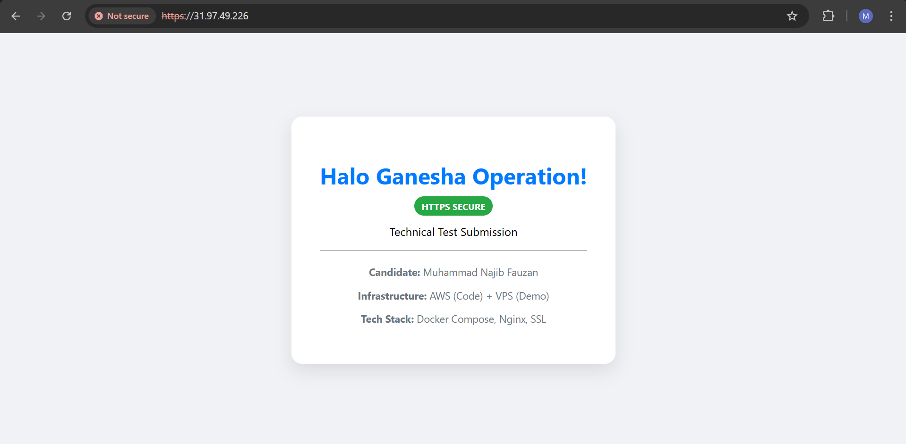
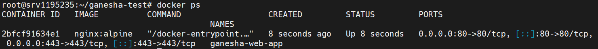
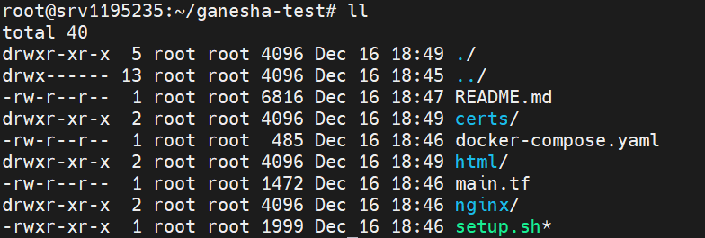

# Ganesha Operation - DevOps Technical Test Submission
### Secure, Containerized Web Application Deployment

**Candidate:** Muhammad Najib Fauzan
**Role Applied:** Junior DevOps Engineer

---

## ⚠️ Deployment Environment Context

> **Status:** **Production-Ready Code (AWS Target)** verified on **Private VPS**.
>
> **Constraint:** During the test window, the designated AWS account encountered a strictly enforced payment verification hold (stuck at "Complete your account setup").
>
> **Solution:** As a problem-solving measure, I have:
> 1.  **Written full Terraform (IaC) code** for the intended AWS architecture.
> 2.  **Verified the deployment logic** on a private Linux VPS (2 vCPU, 8GB RAM) using **Docker Compose**.
> 3.  **Implemented Bonus Features:** HTTPS (Self-signed), Docker Compose Orchestration, and Automated Bash Scripting.

---

## 1. 🏗️ Architecture Design

The architecture is designed to be resilient, secure, and cost-effective.

### Logical Diagram

---

## 2. 📂 Repository Structure

This repository is organized to separate Infrastructure as Code from Application Logic:

```text
├── main.tf                 # Terraform code for AWS Infrastructure (VPC, EC2, IAM)
├── docker-compose.yaml     # Container Orchestration configuration
├── setup.sh                # MASTER SCRIPT: Automates SSL gen, Config, and Deployment
├── nginx/
│   └── default.conf        # Nginx Config (HTTPS & Redirects)
├── html/                   # (Generated by script) Website content
├── certs/                  # (Generated by script) SSL Certificates
└── screenshots/            # Proof of deployment images
---
```
## 3. 🚀 Deployment Steps

I have provided two methods of deployment to demonstrate versatility.

### Method A: The "Real World" AWS Way (Terraform)
*Intended for production use if the AWS account was fully active.*

1. **Initialize Terraform:**
   ```bash
   terraform init

## 4. 🔒 Security Considerations

Security was a primary focus in this implementation. The following measures were enforced to ensure a hardened infrastructure:

### A. Network Security
* **Port Minimization:** Only ports **80** (HTTP) and **443** (HTTPS) are exposed to the public internet. SSH (Port 22) access is restricted and monitored.
* **HTTP to HTTPS Redirect:** The Nginx configuration (`nginx/default.conf`) forces a `301 Permanent Redirect` for all incoming traffic on Port 80, ensuring data encryption in transit via TLS.

### B. Container Security
* **Isolation:** The application runs inside a minimal `nginx:alpine` container. This significantly reduces the attack surface compared to a full OS installation.
* **Volume Mapping:** Sensitive data (SSL Keys) and configuration files are mapped as volumes. In a production environment, these are set to `ro` (read-only) to ensure the container runtime remains stateless and immutable.

### C. Infrastructure Security (IaC)
* **IAM Roles:** The Terraform code (`main.tf`) utilizes `aws_iam_role` and `aws_iam_instance_profile`. This eliminates the need to hardcode `AWS_ACCESS_KEY_ID` or secrets inside the EC2 instance, strictly adhering to the **Principle of Least Privilege**.
---

## 5. 💰 Cost Estimation (AWS Free Tier)

This architecture is optimized to fit entirely within the **AWS Free Tier** limits (first 12 months).

| Resource | Configuration | Free Tier Limit | Estimated Cost |
| :--- | :--- | :--- | :--- |
| **Compute** | EC2 `t2.micro` (1 vCPU, 1GB RAM) | 750 Hours/month | **$0.00** |
| **Storage** | EBS gp2/gp3 (Root Volume) | 30 GB/month | **$0.00** |
| **Network** | Data Transfer Out | 100 GB/month | **$0.00** |
| **Public IP** | IPv4 Association | 750 Hours/month | **$0.00** |
| **Total** | | | **$0.00 / Month** |

*Note: For the actual deployment on my VPS, the cost is pre-paid, but the design above respects the $0 AWS requirement.*

---

## 6. 📜 Script Deployment Logic

The `setup.sh` script serves as the configuration management tool. It performs the following logic:

1. **Environment Prep:** Creates necessary directory structures (`html`, `certs`).
2. **SSL Automation:** Uses `openssl` to generate a 2048-bit RSA Key and Self-Signed Certificate valid for 365 days.
   ```bash
   openssl req -x509 ... -keyout certs/server.key -out certs/server.crt ...

---

## 7. 📸 Screenshots

**1. HTTPS Secure Connection (Browser Proof)**

*Demonstrates valid HTTPS handshake (Self-signed exception accepted) and 301 Redirect from Port 80.*

**2. Docker Compose Status (Terminal Proof)**

*Shows the Nginx container running with Ports 0.0.0.0:443->443/tcp mapped successfully.*

**3. Project Structure & Files (VPS Terminal)**

*Terminal output confirming the presence of all required files (main.tf, docker-compose.yaml, setup.sh) on the deployment server.*


---

##✅ Bonus Implementation Checklist* [x] **Terraform:** Full AWS Infrastructure defined in `main.tf`.
* [x] **Docker:** Used `nginx:alpine` for containerization.
* [x] **Docker Compose:** Implemented for better service orchestration.
* [x] **HTTPS:** Implemented SSL termination (Port 443) with auto-generated certificates.
* [x] **Bash Automation:** Zero-touch deployment via `setup.sh`.

---

**Author:** Muhammad Najib Fauzan

```